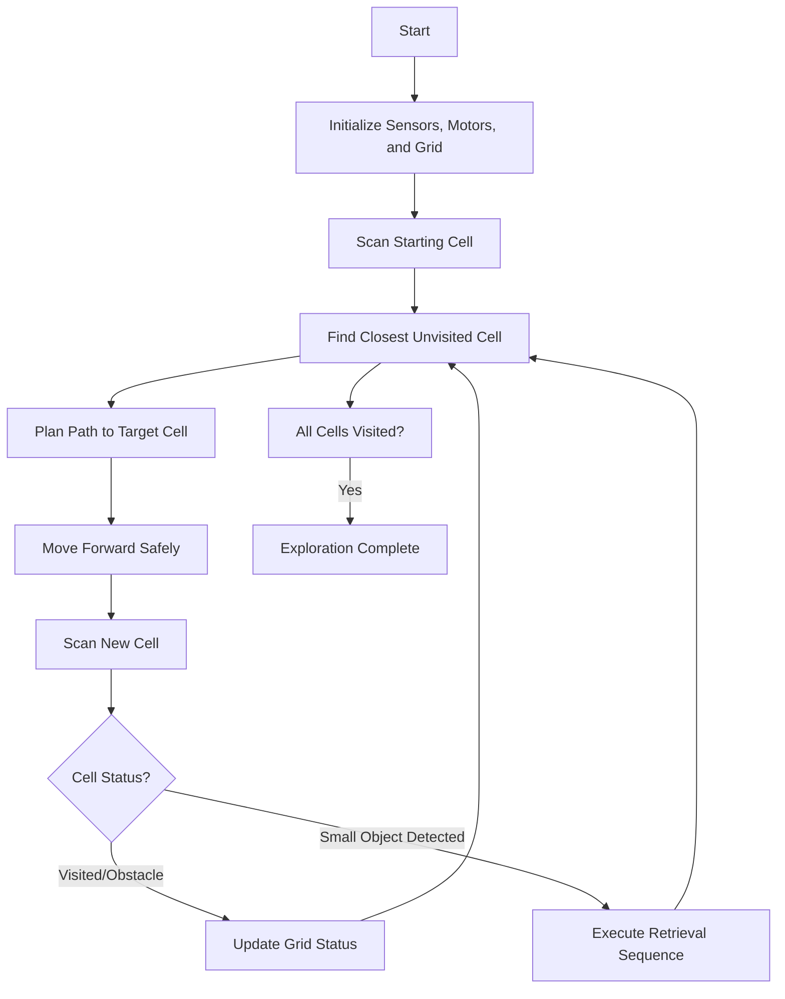
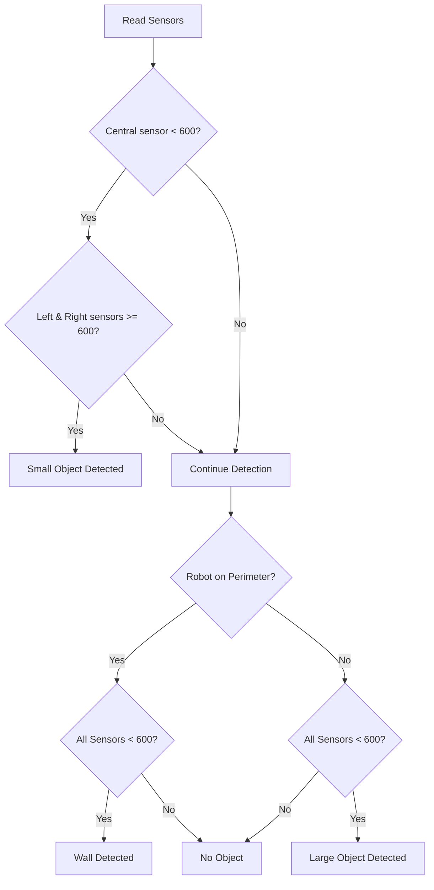
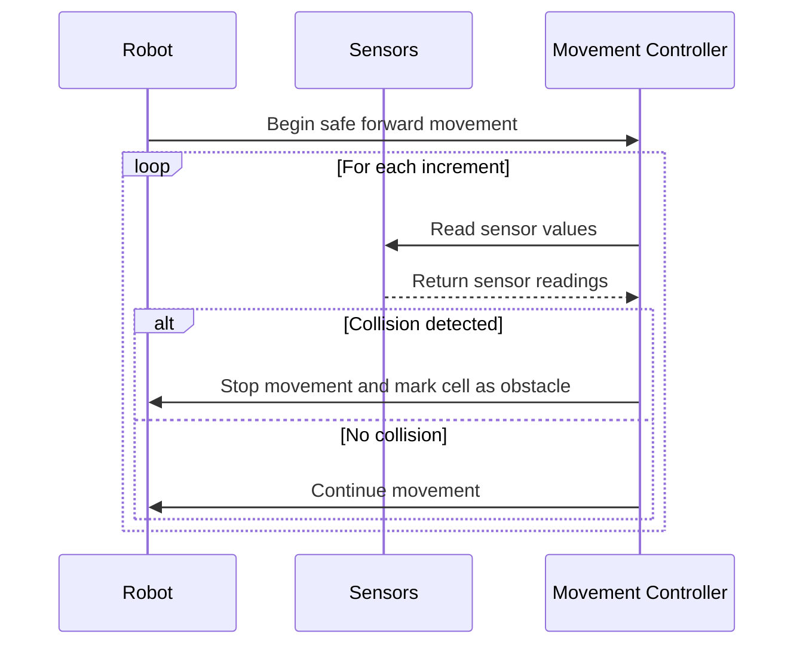

+++
title = "Autonomous Trash Collector Robot"
url = "trash_collector_robot"
summary = "PHYS-S12 - Intro to Digital Fabrication - Final Project Documentation"
author = "silviafesta2"
draft = false
hero_thumb = "/images/trash-collector-robot.jpg"
hero_thumb_height = 400        # Altezza visibile in pixel
hero_thumb_offset_y = 40
images = ["/images/trash-collector-robot.jpg"]
tags = ["harvard","project"]
featured = true
+++

## Project Overview

For my final project, I built a smart autonomous robot capable of detecting and picking up small objects. This robot can be employed for street trash collection as well as for domestic tasks such as tidying rooms.

## demo video:


## How Does It Work?

The robot autonomously navigates environments, detects obstacles and objects with TOF laser sensors, and picks objects with a precision robotic arm controlled by servo motors. The system is driven by ESP32-based hardware.

---

## Materials & Components

### **Motors**
- 2× [Stepper motor Nema 17HS13-0404S1](#)
- 4× [MG90S Metal Geared Micro Servo Motor](#)
- 2× [MG996R Metal Geared Servo Motor](#)

### **Boards and Motor Drivers**
- 1× [ESP32 Feather (Huzzah)](#)
- 1× [Protoboard](#)
- 2× [Stepper Motor Driver A4988](#)
- 1× [CNC Shield](#)
- 1× [Servo driver PCA9685](#)

### **Sensors**
- 3× [GY-VL53L0XV2 L53L0X TOF Sensor](#)

### **Wheels**
- 2× [Traction Wheels](#)
- 1× [Swivel wheel](#)

### **Connections**
- Dupont cable kit
- Jumper Dupont cable
- USB connector and cables
- Battery holder
- Terminal block connector
- Pin strip kit

### **Power Supply**
- 3× [Lithium battery 3.7 V](#)

### **Other Components**
- LM2596S DC-DC 24V/12V to 5V 5A converter
- Switch
- 2× Resistor 1kΩ
- Hexagonal spacers kit
- Screw kit
- Insulant tape

---

## CAD Design and Prototyping

Initially, I designed the robot using Fusion 360, experimenting with different wheel configurations to optimize stability and maneuverability. Two physical prototypes were tested, with the three-wheel design ultimately proving superior.

### final design:


---

## 3D Printing and Laser Cutting

### Chassis
The robot's chassis was fabricated using laser cutting. It consists of two identical structural components positioned one above the other, providing strength, stability, and ease of assembly.


### Spacers
The two main chassis plates are held securely together by custom-designed, 3D-printed spacers, ensuring structural integrity and consistent alignment.


### Sensors holder
The laser distance sensors are firmly secured using a custom-designed, 3D-printed holder. This ensures consistent positioning, accurate measurements, and reliable operation during robot navigation and object detection tasks.


### Connector
I designed a low-profile connector to securely attach structural components of the robot chassis, reducing the assembly's overall height and ensuring it could easily navigate compact spaces.


## Mechanical Arm
I sourced the mechanical arm design online and customized several components to better suit the specific requirements of my project. The original design reference can be found at [this link](https://howtomechatronics.com/tutorials/arduino/diy-arduino-robot-arm-with-smartphone-control/).


## Electronics

Initially, I selected the **Metro board** for this project due to its numerous available pins suitable for diverse applications. However, I later transitioned to the **ESP32 Feather (Huzzah)** board, recognizing its integrated Wi-Fi capability, which facilitates wireless control and monitoring.

Given the project's requirement to simultaneously operate 3 sensors, 2 stepper motors, and 4 servo motors—typically requiring around 14 GPIO pins—I developed solutions to efficiently utilize the limited pin availability on the ESP32:

- **PCA9685 Servo Driver:** Enables control of up to 16 servo motors using only two I²C pins (SCL and SDA), significantly reducing GPIO pin usage.

- **Custom Protoboard:** I fabricated a dedicated protoboard to centralize common lines such as GROUND, +3V, SCL, and SDA. This configuration allowed for multiple sensor connections without consuming additional GPIO pins.

These are the circuit diagrams:





# Software

## Introduction
I structured the Arduino code into three main functional components: **stepper motor control**, **mechanical arm operation**, and **sensor management**. Starting from example sketches, I adapted and expanded code from the `Adafruit_VL53L0X` and `Adafruit_PWMServoDriver` libraries, tailoring them specifically for this project's requirements.

The robot's software logic assumes prior knowledge of both the rectangular geometry of the room, defined precisely in centimeters, and its initial starting position represented by accurate *x* and *y* coordinates. Leveraging precise positional tracking provided by the stepper motors, the Arduino program can effectively differentiate between walls and large obstacles. Specifically, if only the central LiDAR sensor detects an object, the robot identifies it as a small, collectible item and initiates the object retrieval sequence. Conversely, when multiple sensors simultaneously detect an obstacle, the robot classifies it as either a larger movable obstacle—triggering an autonomous avoidance maneuver—or a fixed wall, prompting it to adjust its direction accordingly.

## Grid-Based Exploration and Object Retrieval System Documentation
This section explains the algorithm and software implemented on an Arduino-based robot that navigates an environment divided into a grid. The robot uses three VL53L0X laser sensors for distance measurements and a PCA9685-based servo driver for object retrieval. The system is designed to:
1. **Explore a defined grid**: The environment is partitioned into cells.
2. **Detect objects**: Classify objects as small (for retrieval), walls, or large obstacles.
3. **Avoid collisions**: Move in small increments with continuous sensor checks.
4. **Plan paths**: Greedily select the closest unvisited free cell and navigate there using diagonal, horizontal, and vertical movements.

---

## System overview
The Finite State Machine diagram of the system is represented in the following diagram

## Algorithm description
The environment is divided into a grid of squares defined by three parameters:
1. **GRID_ROWS**: Total rows in the grid.
2. **GRID_COLS**: Total columns in the grid.
3. **CELL_SIZE_MM**: Side of the size of the squares.

The process is the following:
1. **Initialization**: The grid is initialized with all cells marked as unvisited. The starting cell is immediately marked as visited.
2. **Target Selection**: The robot continually searches for the closest unvisited cell that is not marked as an obstacle.
3. **Path Planning and Movement**: Once a target is selected, the robot uses a greedy approach to move horizontally, vertically, or diagonally to reach the cell while updating its current grid coordinates.

## Sensor Based Object Detection
The robot uses three VL53L0X sensors: left, center, and right. Based on their readings, the robot determines what is in front of it with the following rules:
- **Small Object**: If only the central sensor returns a reading below 600 mm, a small object is detected. The robot then executes the retrieval sequence.
- **Wall**: If the robot is on the perimeter of the grid (i.e., at the edge) and all three sensors read below 600 mm, the cell is treated as part of a wall.
- **Large Object**: In interior grid cells (not on the perimeter), if all three sensors read below 600 mm, the cell is marked as containing a large object. The robot will avoid these cells.

---

## Collision Avoidance and Safe Movement
To ensure collision avoidance, the robot moves forward in small increments (e.g., one-quarter of a cell) and checks sensor readings after each step. If a collision risk (wall or large object) is detected, the movement stops immediately and the current cell is marked as an obstacle.

## Navigation Strategy
The navigation strategy employs a greedy algorithm that selects the nearest unvisited cell and then:
- Uses horizontal moves when only the X-axis movement is needed.
- Uses vertical moves when only the Y-axis movement is needed.
- Uses diagonal moves (if both axes require movement and the diagonal cell is free) by turning 45° right, moving forward, and then turning 45° left to reorient.

## Code Structure
The source code is organized into the following sections:
1. **Hardware Definitions & Global Settings**: Pin assignments, sensor calibration values, and grid parameters are declared here.
2. **Movement Functions**: 
   - moveForwardSafe(): Moves the robot forward in small, safe increments with continuous collision checks.
   - turnRight() and turnLeft(): Rotate the robot 90°.
   - diagonalMove(): Combines turning and forward movement for a diagonal move.
3. **Sensor and Servo Functions**:
   - Sensor initialization and setup.
   - Functions to convert angles to PWM values and set servo positions.
   - servoPick(): Executes the retrieval sequence for small objects.
4. **Grid-Based Exploration Functions**:
    - Grid initialization and cell state updates
    - Functions for scanning the current cell and determining the cell status.
    - Functions to find and navigate to the closest unvisited cell.
5. **Main Loop**: The main loop calls the exploration function until all free cells are visited, then halts further movement.

## Testing and Results
The algorithm has been tested in indoor environments, where the robot demonstrated millimetric precision in its movements. Even without a closed-loop feedback system, the position remained accurate during all tests due to strong ground adherence. However, it is important to note that in the absence of real-time feedback, disturbances or motor slips during movement could lead to small but cumulative localization errors. Nonetheless, under all tested conditions the robot maintained strong traction and successfully navigated and updated its grid status as expected.

## Future Work
Future enhancements may include:
- Advanced Path Planning: Implementing algorithms like A* for optimal path planning.
- Enhanced Sensor Fusion: Integrating additional sensors or filtering techniques to improve detection accuracy.
- Dynamic Re-Planning: Enabling real-time updates to the grid map to handle moving obstacles.
- User Interface: Developing visualization tools for real-time object detection and progress monitoring.
- Position Estimation Algorithms: Integrating SLAM techniques to continuously estimate the robot's position and compensate for movement inaccuracies.

## Conlcusion
This documentation details the design and implementation of a grid-based exploration and object retrieval system for an Arduino-based robot. The algorithm integrates sensor data, grid mapping, collision avoidance, and a greedy navigation strategy to explore a predefined environment effectively. The modular design ensures ease of modification and extension, making it a strong foundation for advanced robotics research and applications.

